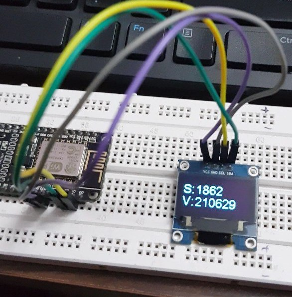

# Youtube Subscriber and View Counter

The 'Youtube Subscriber and View Counter' is a device made using NodeMCU (ESP8266) and OLED display. You can use this device to view your youtube's subscriber and view count. You can view the complete instruction to build this device from [this link](https://www.sashwat.in/).

# Requirements

1. A WiFi access point with active internet.
2. NodeMCU
3. OLED display
4. 4 jumper pins
5. power supply
6. Arduino IDE (For editing and flashing code to NodeMCU)

# Instructions

1. clone the repository.
2. Open the code in Arduino IDE.
3. Connect the four pins of OLED display VCC, GND, SCL and SDA to NodeMCU's VCC, GND, D0 and D1.
4. Make necessary changes to the code like adding WiFi credentials, API key and channel ID.
5. Flash code to NodeMCU.

And Its done.